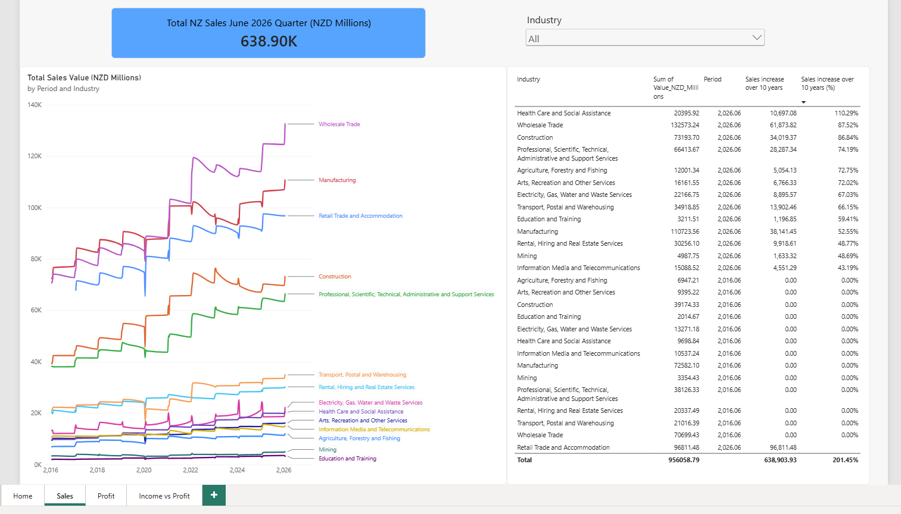
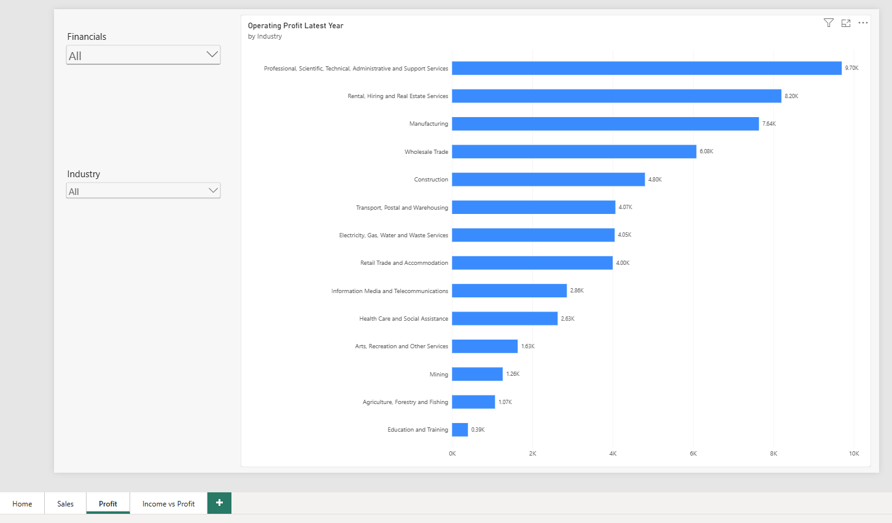
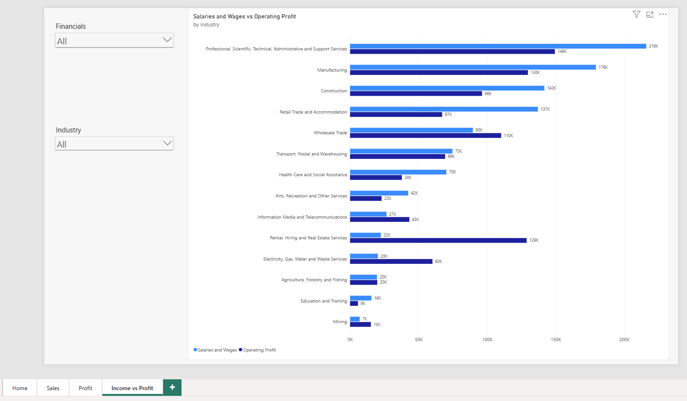

# NZ Business Financial Data Analysis (June 2026 Quarter)

## Project Overview
This project analyses New Zealand business financial performance across industries using data from Stats NZ. The dataset covers quarterly financial data from 2016 to June 2026, including Sales, Purchases & Operating Expenditure, Salaries & Wages, and Operating Profit across 14 NZ industries.

The goal of this project is to uncover trends in NZ business performance, identify the most profitable industries, and visualise how different sectors have grown over the past decade.

---

## Dashboard Preview

### Page 1 Sales — Total Sales Trend by Industry (2016–2026)


### Page 2 Profit — Operating Profit by Industry


### Page 3 Income vs Profit — Salaries & Wages vs Operating Profit


---

## Tools Used
- **Power BI Desktop** — data modelling, DAX measures, and dashboard visualisation
- **Microsoft SQL Server Management Studio (SSMS)** — SQL queries for data exploration and analysis
- **GitHub** — version control and portfolio hosting

---

## Data Source
- **Dataset:** Business Financial Data — June 2026 Quarter
- **Source:** [Stats NZ — Tatauranga Aotearoa](https://www.stats.govt.nz)
- **Coverage:** Quarterly data from 2016 to June 2026
- **Industries:** 14 NZ industries at NZSIOC Level 1

---

## Key Findings

### Sales Trends & 10-Year Growth (2016–2026)
1. **Total NZ business sales reached NZD $638.90K million** in the June 2026 quarter across all industries combined.
2. **Wholesale Trade is the largest industry by sales** at NZD $132,573 million in June 2026, followed by Manufacturing ($110,724 million) and Retail Trade & Accommodation ($96,812 million).
3. **Health Care and Social Assistance recorded the highest 10-year sales growth** at 110.29% — the fastest growing industry over the decade, more than doubling in size.
4. **Wholesale Trade grew 87.52%** and **Construction grew 86.84%** over 10 years — both strong performers.
5. **Professional, Scientific, Technical, Administrative and Support Services grew 74.19%** over 10 years, reflecting strong demand for knowledge-based services in NZ.
6. **A visible dip occurred across all industries around 2020**, consistent with the COVID-19 impact, followed by a strong and sustained recovery from 2021 onwards.
7. **Total sales across all industries grew 201.45% over 10 years** — more than doubling overall NZ business revenue since 2016.

### Operating Profit by Industry
8. **Professional Services is the most profitable industry** at NZD $9.70K million — despite not being the highest in total sales, indicating significantly higher profit margins than volume-driven industries.
9. **Rental, Hiring and Real Estate Services ranks second in profitability** at $8.20K million, followed by Manufacturing at $7.64K million.
10. **Education and Training has the lowest operating profit** at $0.39K million, reflecting the largely non-commercial nature of the sector.

### Salaries & Wages vs Operating Profit
11. **Professional Services pays the highest salaries** at NZD $216K million total, yet also generates the highest operating profit — suggesting strong revenue efficiency.
12. **Rental, Hiring and Real Estate Services shows a striking contrast** — very low salaries ($22K million) but very high operating profit ($129K million), indicating a highly capital-driven, low-labour business model.
13. **Health Care and Social Assistance as well as Retail Trade & Accommodation are heavily salary-dependent** — salaries are nearly double their operating profits reflecting the labour-intensive nature of those industries.

---

## SQL Queries
See [`queries.sql`](queries.sql) for the full set of SQL queries used to explore and analyse this dataset, including:
- Top industries by sales and operating profit
- Salary and wage trends over time
- Profit margin by industry

---

## How to View the Dashboard
1. Download [`nz_business_financial.pbix`](nz_business_financial.pbix) from this repository
2. Open it in [Power BI Desktop](https://powerbi.microsoft.com/desktop) (free)
3. Use the **Financials** and **Industry** slicers to filter by specific variables or sectors
4. Navigate between the 3 pages using the page navigator

---

## Repository Structure
```
Data-and-Reporting-Projects/
│
├── README.md                                          # This file
├── Business financial data project.pbix               # Power BI dashboard file
├── dashboard_page1_sales.png                          # Sales trend page screenshot
├── dashboard_page2_profit.png                         # Operating profit page screenshot
├── dashboard_page3_income_vs_profit.png               # Salaries vs profit page screenshot
├── Business financial data project.sql                # SQL queries used in analysis
└── business-financial-data-June-2026-quarter.csv      # Raw dataset
```

---

## About Me
I am an IT professional with experience in application support and interest in data analytics and business intelligence. This project is part of my portfolio demonstrating skills in Power BI, DAX, and SQL using real New Zealand government data.

📧 Connect with me on [LinkedIn](#) *(https://www.linkedin.com/in/alecanalyst/)*
